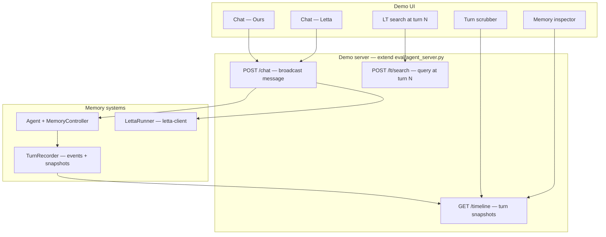

# Frontend Demo Plan — Reddit Launch

Interactive side-by-side demo: **our novelty-governed memory manager vs. real Letta (MemGPT)**,
with turn-by-turn memory introspection. Users clone the repo, export an API key, run
`docker compose up`, and watch how each system handles context overflow under a tiny budget.

The eval suite ([evalplan.md](evalplan.md)) proves the claim with numbers. **This demo makes
people feel it** — the turn scrubber and memory inspector are the Reddit product.

---

## Goals

| Goal | Why |
|---|---|
| Side-by-side chat under small context windows | Pressure hits fast; eviction/compression visible in a few turns |
| Turn-by-turn memory inspector (ours) | Killer differentiator — rewind and see *why* a fact survived or died |
| Real Letta baseline | Authentic comparison vs MemGPT/Letta, not a strawman FIFO sim |
| Clone repo + add key + one command | Target audience on Reddit tolerates setup if payoff is immediate |
| Pre-baked demo scenarios | Users shouldn't have to design an experiment to see the system win |

**Not in scope for v1:** fancy live animation, full Letta internal block introspection (API
may not expose it), LLM-self-manage mode as default (algorithmic mode is the research story).

---

## Architecture overview



### Existing code to reuse

| Module | Role |
|---|---|
| [`cli.py`](cli.py) | Agent wiring, `/status` memory prompt pattern |
| [`eval/agent_server.py`](eval/agent_server.py) | FastAPI shell — extend, don't rewrite |
| [`eval/baselines/letta_runner.py`](eval/baselines/letta_runner.py) | Letta ingest + query |
| [`eval/cost.py`](eval/cost.py) | Per-turn cost tally in UI |
| [`memory/config.py`](memory/config.py) | Tunable knobs; load frozen config from tuning |
| [`llm_client.py`](llm_client.py) | OpenRouter routing for matched Sonnet |

### New backend pieces

**1. `TurnRecorder`** — hook into `MemoryController.receive()` and `compression_tick()`

Emits structured events before/after state changes:

```python
# Event types
COMPRESS   # block_id, fidelity_before, fidelity_after, token_cost_before/after
EVICT      # block_id → lt_id
PROMOTE    # lt_id → block_id
AUGMENT    # block_id, merged content excerpt
INSERT     # new block_id, novelty_score
```

After each turn, append a **snapshot** to an indexed timeline:

```python
TurnSnapshot {
  turn: int
  user_message: str
  assistant_reply: str
  budget_used: int
  budget_max: int
  context_blocks: [BlockView]   # id, excerpt, novelty, decay, fidelity, token_cost, tier
  lt_count: int
  lt_blocks: [LTBlockView]      # for search at this turn — full copy or ref to snapshot store
  events: [MemoryEvent]
  cost_usd: float
  latency_ms: float
}
```

**2. Demo session API**

```
POST /session/start     → { session_id, budget, model }
POST /session/{id}/chat → { user_message } → { turn, ours_reply, letta_reply, snapshot_id }
GET  /session/{id}/timeline           → all turn snapshots (ours)
GET  /session/{id}/turn/{n}           → snapshot at turn n
POST /session/{id}/turn/{n}/lt/search → { query, top_k } → ranked LT blocks at that moment
POST /session/{id}/demo-script/{name} → run pre-baked scenario step
```

**3. Dual-chat orchestration**

On each user message:
1. Broadcast same text to **Agent** (ours) and **LettaRunner** in parallel
2. Record ours snapshot via `TurnRecorder`
3. Record Letta reply + latency + cost (internal memory opaque)
4. Return both replies + snapshot index

---

## UI layout

```
┌─────────────────────────────────────────────────────────────────┐
│  Memory Manager Demo          Budget: [400|800|1200]  Cost: $0.04│
├──────────────────────────────┬──────────────────────────────────┤
│  OUR SYSTEM                  │  LETTA (MemGPT)                  │
│  ┌────────────────────────┐  │  ┌────────────────────────────┐  │
│  │ chat messages...       │  │  │ chat messages...           │  │
│  └────────────────────────┘  │  └────────────────────────────┘  │
│  [message input]             │  (same input, broadcast)          │
├──────────────────────────────┴──────────────────────────────────┤
│  Turn timeline:  [1] [2] [3] [4●] [5]                             │
├─────────────────────────────────────────────────────────────────┤
│  MEMORY INSPECTOR (turn 4) — our system only                    │
│  Context: 3 blocks / 387 tokens                                 │
│  ┌──────────┬─────────┬───────┬─────────┬──────────┐            │
│  │ block    │ novelty │ decay │ fidelity│ tokens   │            │
│  ├──────────┼─────────┼───────┼─────────┼──────────┤            │
│  │ abc123…  │ 0.87    │ 0.94  │ 1.00    │ 142 full │            │
│  │ def456…  │ 0.23    │ 0.12  │ 0.71    │  38 stub │            │
│  └──────────┴─────────┴───────┴─────────┴──────────┘            │
│  Events: PROMOTED lt_7 → abc123 | COMPRESSED def456 (f 1.0→0.71)│
│  LT store (12 blocks): [search: "API key" ] → top-3 results       │
└─────────────────────────────────────────────────────────────────┘
```

### Letta side — honest asymmetry

Letta's archival memory is **not fully introspectable** via the client API (same limitation
as [`eval/recall_advantage.py`](eval/recall_advantage.py): retention observable through
answers, not block-level). Label clearly in UI:

> **Letta:** agent responses + recall via query. Internal block state not exposed by API.

Show on Letta side: reply text, latency, cumulative cost, context window limit. Do not
imply symmetric block-level introspection.

---

## Pre-baked demo scripts

One-click buttons so users don't invent experiments:

| Script | Steps |
|---|---|
| **Early fact** | Ingest: "My secret code is X92QF1. Never forget this." |
| **Distractor flood** | 8 generic messages (~120 tokens each) |
| **Recall probe** | Ask: "What is my secret code?" |
| **Full demo** | Early fact → flood → mid convo fact → more flood → recall both |

Optional: import generators from [`eval/stress_test.py`](eval/stress_test.py)
(`generate_tiered_facts`, `interleave_tiered`) for richer seeded scenarios.

Default budget: **400 tokens** (forces lifecycle within 3–5 turns).

---

## Phased rollout

### Layer 1 — Reddit MVP (~1 week focused)

Ship this before posting.

- [ ] `TurnRecorder` + snapshot serialization
- [ ] Demo FastAPI server: dual chat, timeline GET
- [ ] Simple frontend (HTML/JS or Streamlit — **not React yet**)
- [ ] Side-by-side chat, turn scrubber, our memory inspector
- [ ] Pre-baked demo script buttons
- [ ] `docker-compose.yml`: Letta + Ollama + demo server
- [ ] README quickstart: 3 commands + screenshot
- [ ] 30–60s screen recording for Reddit post body

### Layer 2 — Full vision (v1.5)

- [ ] Event log with before/after on compress/evict/promote
- [ ] LT similarity search **at selected turn N**
- [ ] Side-by-side recall comparison panel
- [ ] Per-turn cost + latency charts
- [ ] Budget slider (400 / 800 / 1200)
- [ ] Load frozen `MemoryConfig` from [`eval/results/tuning.json`](eval/results/tuning.json)

### Layer 3 — Polish

- [ ] Animated block transitions (compress shrink, evict, promote)
- [ ] Shareable replay URLs (`?session=abc&turn=7`)
- [ ] Optional FIFO sim column (free, no Letta) for dev/no-key mode
- [ ] React rewrite if interaction model is proven

---

## Setup — clone and run

### Prerequisites

```bash
git clone <repo>
cd MemoryManager
python -m venv .venv && source .venv/bin/activate
pip install -r requirements.txt
pip install letta-client   # Letta baseline
```

### Environment

```bash
export OPENROUTER_API_KEY=sk-or-...   # shared: our system + Letta server
# optional: OPENROUTER_API_KEY_MANAGER for separate metering
```

### One command (target UX)

```bash
docker compose up
# → starts: Ollama (embeddings), Letta (:8283), demo server (:8080)
# → open http://localhost:8080
```

Manual fallback documented in README if Docker fails.

### Docker services

| Service | Image / build | Port |
|---|---|---|
| `ollama` | ollama/ollama | 11434 |
| `letta` | letta/letta:latest | 8283 |
| `demo` | Dockerfile (Python + frontend static) | 8080 |

Letta env (same as [evalplan.md](evalplan.md)):

```
OPENROUTER_API_KEY
OLLAMA_BASE_URL=http://ollama:11434
```

Pull `nomic-embed-text` on first run or in compose init.

---

## Fairness — budget sizing

Same framing as evalplan: different units.

| System | Setting | Meaning |
|---|---|---|
| Ours | `--max-tokens N` | Managed memory-block pool only |
| Letta | `context_window_limit ≈ N + 1536` | Total window incl. system/tools + buffer |

Demo defaults: **N = 400** (ours) → Letta window **≈ 1936**.

Expose both in UI so users see the unit difference explicitly.

Both sides route **Sonnet via OpenRouter** ([`llm_client.py`](llm_client.py)).

---

## Frontend tech choice

**Start simple.** Prove the interaction model before investing in React.

| Option | Pros | Cons |
|---|---|---|
| **Streamlit** | Fastest Python-only path | Ugly side-by-side layout, weak turn scrubber |
| **FastAPI + vanilla HTML/JS** | Full control, serves from demo server | More frontend code |
| **React (Vite)** | Best polish | 2–4× longer; defer to Layer 3 |

**Recommendation:** FastAPI backend + single-page HTML/JS (or lightweight Alpine/HTMX).
Reuse [`eval/agent_server.py`](eval/agent_server.py) patterns.

---

## Reddit post strategy

### Title (example)

*Side-by-side demo: novelty-governed memory vs MemGPT/Letta — watch context eviction live under a 400-token budget*

### Post body

1. One paragraph: FIFO evicts by age; we evict by novelty + access frequency
2. Embedded screen recording (turn scrubber showing early fact surviving)
3. Clone + `docker compose up` + open localhost
4. Link to free eval for skeptics: `python eval/recall_advantage.py --systems ours_stub,fifo ...`
5. Ask: "Does the demo feel fair? What scenarios would you stress-test?"

### Subreddits

- r/LocalLLaMA — runnable local demo, Docker OK
- r/LLMDevs — technical audience
- r/MachineLearning — project posts / Show-and-Tell
- r/artificial — broader audience, lead with video

### What eval provides in comments

When skeptics ask "where are the numbers?", point to:
- [`eval/results/free_smoke.json`](eval/results/free_smoke.json) — free, no API
- [`eval/plot_results.py`](eval/plot_results.py) — chart generation
- Paid Part B / LoCoMo runs when complete

---

## Risks and mitigations

| Risk | Mitigation |
|---|---|
| Letta Docker friction kills try rate | `docker compose up` one-liner; README troubleshooting; optional FIFO column for no-Docker |
| Letta memory not introspectable | Label asymmetry in UI; compare recall answers, not internal blocks |
| Historical LT search is hard | Snapshot full LT state per turn in SQLite sidecar; defer to Layer 2 if needed |
| API cost scares users | Show running cost tally; default to small demo script (~$0.10–0.30 total) |
| Scope creep (React, animation) | Ship Layer 1 first; Reddit post with screen recording beats perfect UI |
| Embedding mismatch (MiniLM vs nomic) | Document in README; same as evalplan accepted limitation |

---

## Relationship to eval suite

| Artifact | Role |
|---|---|
| **Frontend demo** | Engagement, intuition, shareability |
| **`eval/recall_advantage.py`** | Reproducible headline numbers (Part B) |
| **`eval/locomo_eval.py`** | Realistic workload parity (Part A) |
| **`eval/stress_test.py`** | Free NIAH-style dev iteration |
| **`eval/tune.py`** | Frozen config fed into demo defaults |

The demo is **not a replacement** for eval — it's the top of funnel. Eval is the proof
link for comment threads.

---

## Status

- [ ] `TurnRecorder` — not started
- [ ] Demo server API — not started
- [ ] Frontend UI — not started
- [ ] `docker-compose.yml` — not started
- [ ] README quickstart — not started
- [x] Backend primitives exist (`Agent`, `LettaRunner`, `agent_server`, `CostMeter`)
- [x] Free eval smoke validates core claim for Reddit comment link

---

## Minimum checklist before Reddit post

- [ ] README with quickstart (demo first, eval second)
- [ ] `docker compose up` works on clean machine
- [ ] Pre-baked demo script runs end-to-end
- [ ] Turn scrubber shows context at historical turns (ours)
- [ ] Screen recording committed or hosted
- [ ] LICENSE file in repo
- [ ] Honest Letta asymmetry label in UI
